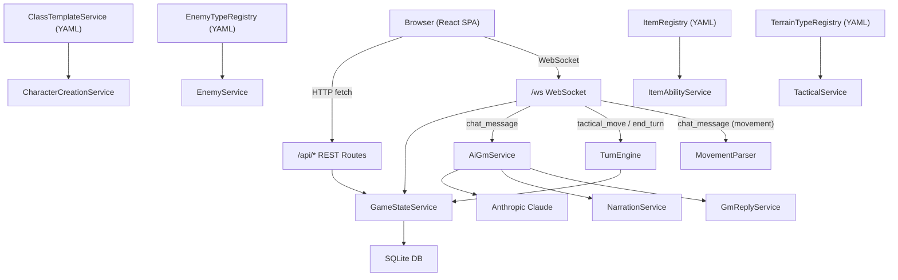
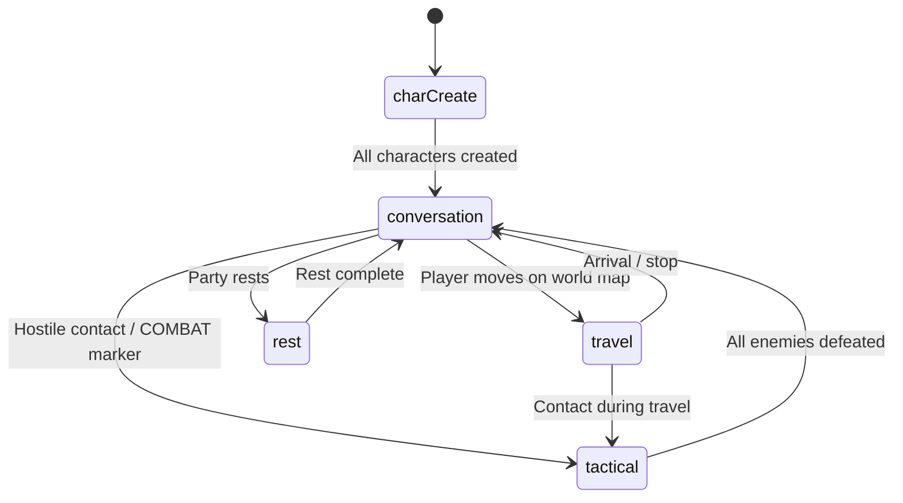

# Gate Life — Architecture Reference

## Monorepo Structure

```
gate_life/
├── packages/shared/     # @gate-life/shared — types, constants, dice helpers
├── server/              # Fastify API + WebSocket + SQLite
├── client/              # React + Vite SPA
├── class_templates/     # YAML class definitions (e.g. dog_boy.yaml)
├── content/             # YAML content registries
│   ├── enemies/         # Enemy type templates
│   ├── items/           # Item templates
│   ├── terrain/         # Terrain type definitions
│   └── entity-types/    # Scenario entity type metadata
└── docs/                # Documentation
```

**Dependency flow**: `shared` → `server` + `client` (shared is consumed by both).

## Tech Stack

| Layer | Technology |
|-------|-----------|
| Frontend | React 19, Vite 6, TypeScript, Leaflet (maps), uPlot (charts) |
| Backend | Fastify 5, WebSocket, TypeScript |
| Database | SQLite via better-sqlite3 |
| AI | Anthropic Claude SDK (GM narration, agent chat) |
| Content | YAML templates loaded at startup |

## Data Flow



## Session Modes (FSM)

Sessions transition through these modes:



**ModeController** (`server/src/services/ModeController.ts`) enforces valid transitions and hooks the turn engine / world clock on enter/exit.

## Server Architecture

### WebSocket Message Handlers (`ws/handlers/`)

| File | Message Types |
|------|--------------|
| `joinSession.ts` | `join_session`, `register_combatant` |
| `chat.ts` | `chat_message` (movement parsing, agent commands, AI GM) |
| `tactical.ts` | `tactical_move`, `end_turn`, `follow_response`, `ping` |

The thin router in `ws/handler.ts` dispatches to these handlers.

### AI GM Pipeline (`services/gm/`)

| File | Responsibility |
|------|---------------|
| `shared.ts` | System prompt construction, marker regexes, damage/roll/item processing |
| `NarrationService.ts` | Opening narration, enemy sighting, death narration, wandering monsters |
| `GmReplyService.ts` | Player reply handling, marker-driven side effects (combat, POI, items) |
| `AiGmService.ts` | Thin facade re-exporting the `aiGm` singleton |

### Core Services

| Service | Purpose |
|---------|---------|
| `GameStateService` | Central DB facade (delegates to CampaignSessionService + EnemyService) |
| `CampaignSessionService` | Campaign + Session CRUD, mode updates, turn state |
| `EnemyService` | Enemy CRUD, detection, HP tracking, position |
| `TurnEngine` | Initiative, action processing (strike/parry/dodge), turn advancement |
| `CharacterService` | Character creation from class templates |
| `CharacterCreationService` | Class-agnostic rolled creation (dispatches by classId) |
| `ItemAbilityService` | Inventory item ability resolution and effects |
| `ModeController` | Session mode FSM and transition hooks |
| `WorldClockService` | In-game time advancement |

### Content Registries

| Registry | Content Dir | Loaded At |
|----------|------------|-----------|
| `ClassTemplateService` | `class_templates/` | Server startup |
| `EnemyTypeRegistry` | `content/enemies/` | Server startup |
| `ItemRegistry` | `content/items/` | Server startup |
| `TerrainTypeRegistry` | `content/terrain/` | Server startup |
| `EntityTypeRegistry` | `content/entity-types/` | Server startup |

All follow the same pattern: read `*.yaml` files from a directory, parse into a `Map<id, Template>`, expose `get(id)` and `list()` functions.

## Client Architecture

### Routing (`App.tsx`)

| Path | Component | Purpose |
|------|-----------|---------|
| `/` | `Lobby` | Campaign list, scenario list, join/create |
| `/game` `/game/:campaignId` | `GameLayout` | In-game: chat, tactical, map |
| `/builder` `/builder/:scenarioId` | `ScenarioBuilder` | Scenario authoring wizard |

### State Management

`GameContext.tsx` uses `useReducer` with a central `GameState`:

- **Identity**: `userId` (persisted in localStorage), `role`, `myCharacterId`
- **Game**: `campaign`, `session`, `party`, `worldNpcs`, `detectedEntities`
- **UI**: `messages`, `connected`, `gmThinking`, `diceRollQueue`

WebSocket subscriptions update state via dispatched actions.

### Key Component Trees

**GameLayout** (in-game):
- `TurnTracker` — round/turn/APM display
- `TacticalBoard/` — canvas grid (hooks: `useTacticalCanvas`, `useTacticalInput`)
- `ChatPanel` — message stream + input
- `MapPanel` — Leaflet world map
- `PartyHUD` — party roster cards
- `DiceRollWidget` — animated dice overlay

**ScenarioBuilder/** (authoring):
- `InfoStep` — name, GM kind, SettingDesigner, WanderingMonsterDesigner
- `MapStep` — ScenarioMapPanel + entity/dungeon panels
- `ReviewStep` — summary + save

## Database Schema (Key Tables)

| Table | Purpose |
|-------|---------|
| `campaigns` | Campaign metadata, GM config, grid origin |
| `sessions` | Active game session, mode, turn state |
| `combatants` | Player + agent characters (stats, inventory, position) |
| `enemies` | Scenario entities on the tactical board |
| `messages` | Chat history |
| `game_events` | Event log (combat, movement, etc.) |
| `tactical_terrain` | Terrain tiles per session |
| `scenarios` | Authored scenario definitions |
| `scenario_entities` | Entities placed in a scenario |
